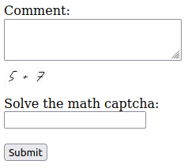

# A Simple Flask Math Captcha

## Description

This math captcha only implements addition at the moment as it should be enough to deter most bot posts. Other operations can be requests.

This code works with pillow-8.4.0 and pillow-9.4.0. No other versions of pillow have been tested.

## Demonstration
Loading the page for the first time:



Not submitting a math captcha value:


Submitting the wrong math captcha value:


If the submitted form and captcha are valid:


## Development

To save you a few clicks, here is the code.

```python
"""main.py"""
from flask import Flask, render_template, redirect, url_for
from forms import MyForm # required import
import os
from captcha import MathCaptcha # required import

app = Flask(__name__)
app.secret_key = os.urandom(16)

@app.route('/', methods=['GET', 'POST'])
def home():
    form = MyForm()
    captcha = MathCaptcha()
    message=None

    if form.validate_on_submit():
        # check is math captcha is valid
        if captcha.is_valid(form.captcha_id.data, form.captcha_answer.data):
            print(form.comment.data) # do <thing> with comment here
            return redirect(url_for('home'))

        message = 'Incorrect answer!'

    # set the form math captcha
    form.captcha_id.data, form.captcha_b64_img_str = captcha.generate_captcha()

    return render_template('home.html', form=form, message=message)

app.run('0.0.0.0', port=5000, debug=True)
```
```html
<!-- /templates/home.html -->
<!DOCTYPE html>
<html lang="en">
<body>
  
    <form method="POST" action="/" novalidate>
      {{ form.csrf_token }}
      {{ form.captcha_id }} <!-- Add this! It's the hidden form field. -->

      {{form['comment'].label}}<br>
      {{form['comment'](rows='3', cols='30')}}<br>
      
        <span class="message">{{ error }}</span><br>
      

      <!-- Add this! It's the math captcha. -->
      <br>
      {{form['captcha_answer'].label}}<br>
      {{form['captcha_answer'](rows='5', cols='20')}}<br>
      
        <span class="message">{{ error }}</span><br>
      

      <br>
      <input type="submit" value="Submit" class="button">
    </form>
    

    <!-- Optional -->
    
      {{ message }}
    
</body>
</html>
```
```python
"""forms.py"""
from flask_wtf import FlaskForm
from wtforms.fields import TextAreaField, StringField, HiddenField
from wtforms.validators import DataRequired

class MyForm(FlaskForm):
    comment = TextAreaField("Comment:", validators=[DataRequired()])
    
    captcha_id = HiddenField(validators=[DataRequired()])
    captcha_answer = StringField("Solve the math captcha:", validators=[DataRequired()])

```
```python
"""captcha.py"""
from random import random
from PIL import Image, ImageDraw, ImageFont, ImageColor
import base64
from io import BytesIO
import os

class MathCaptcha:
  """
  You will need a tff from somewhere as pillow (PIL) doesnt provide any.
  
  Tested on pillow-8.4.0 and pillow-9.4.0
  """
  def __init__(self,
    tff_filename='EXAMPLE.ttf',
    tff_dir=None,
    size = (90, 40),
    font_size=25,
    font_color=ImageColor.getcolor('black', 'RGB'),
    background_color=ImageColor.getcolor('white', 'RGB')
  ):
    tff_dir = os.path.abspath(os.path.dirname(__file__)) if tff_dir is None else tff_dir
    tff_path = os.path.join(tff_dir, 'fonts', tff_filename)

    self.size = size
    self.font = ImageFont.truetype(tff_path, font_size)
    self.font_color = font_color
    self.background_color = background_color

    self.delimiter = ';.;'

  def is_valid(self, test_id, answer):
    if not test_id or not answer: return False
    try:
      decoded = base64.b64decode(test_id).decode()
      first, second = decoded.split(self.delimiter)
      first, second, answer = int(first), int(second), int(answer)
      return first + second == answer
    except:
      return False

  def generate_image(self, text):
    img = Image.new("RGB", self.size, self.background_color)
    draw = ImageDraw.Draw(img)
    xy = (5, 5)
    draw.text(xy, text, self.font_color, font=self.font)
    
    buffered = BytesIO()
    img.save(buffered, format="JPEG")
    img_str = base64.b64encode(buffered.getvalue()).decode()
    return img_str

  @staticmethod
  def generate_random():
    """Returns a random int between 0 and 10 (inclusive)."""
    return int(random()*10)

  def generate_captcha(self):
    first_num = MathCaptcha.generate_random()
    second_num = MathCaptcha.generate_random()

    captcha_id = base64.b64encode(f'{first_num}{self.delimiter}{second_num}'.encode()).decode()
    captcha_b64_img_str = self.generate_image(f'{first_num} + {second_num}')

    return captcha_id, captcha_b64_img_str
```